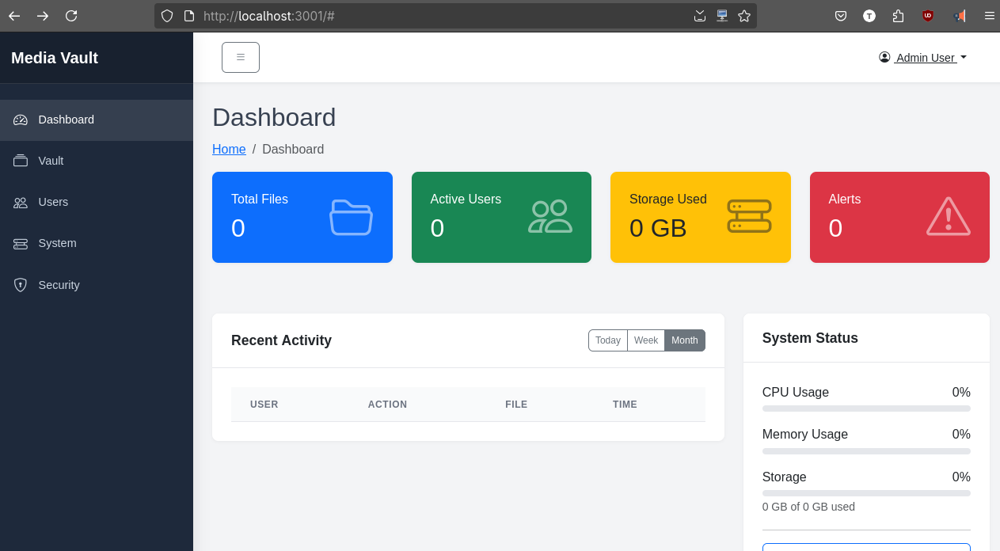

# 🔐 Media Vault - Complete Solution

**Enterprise-grade secure media storage with AI analysis, role-based access, and comprehensive monitoring.**

[](https://github.com/wronai/docker-platform)
[](LICENSE)
[](docker-compose.yml)
[](docs/README.md)
[](#project-status)
[](CONTRIBUTING.md)
[](https://goreportcard.com/report/github.com/wronai/media-vault-backend)
[](https://github.com/wronai/docker-platform/issues)
[](https://github.com/wronai/docker-platform/pulls)

## 🚀 Quick Start

### Prerequisites
- Docker 20.10+ and Docker Compose
- 4GB RAM minimum (8GB recommended)
- Ports 80, 443, 8080, 3000 available

### Local Development Setup
1. Clone the repository:
   ```bash
   git clone https://github.com/wronai/docker-platform.git
   cd docker-platform
   ```

2. Copy the example environment file and update as needed:
   ```bash
   cp .env.example .env
   ```

3. Start the services:
   ```bash
   make up
   ```

### Accessing Services
- **Web UI**: https://localhost
- **Admin Panel**: https://admin.localhost
- **Keycloak**: https://auth.localhost
- **Grafana**: http://localhost:3000
- **API Documentation**: http://localhost:8080/api/docs

## 🛠 Service Management

### Individual Service Control
You can start, stop, and manage individual services using the following commands:

#### Keycloak Services
```bash
make keycloak       # Start Keycloak identity service (http://localhost:8080/admin)
make keycloak-db    # Start Keycloak database
```

#### Media Vault Services
```bash
make media-vault-api         # Start Media Vault API
make media-vault-analyzer    # Start AI Processing service
make nsfw-analyzer          # Start NSFW content detection
```

#### Frontend Services
```bash
make flutter-web          # Start Flutter Web Frontend (http://localhost:3000)
make media-vault-admin    # Start Admin Panel (http://localhost:3001)
```

#### Infrastructure Services
```bash
make caddy    # Start Caddy Reverse Proxy
make redis    # Start Redis Cache
```

### Common Operations

#### Start All Services
```bash
make up
```

#### Stop All Services
```bash
make down
```

#### View Logs
```bash
make logs
```

#### Rebuild and Restart a Service
```bash
docker-compose up -d --build <service-name>
```

## ✨ Key Features

### Core Features
- **Secure File Storage**: End-to-end encrypted media storage with AES-256 encryption
- **AI-Powered Analysis**: Automatic media tagging, face recognition, and content description
- **Role-Based Access Control**: Fine-grained permissions with support for custom roles
- **Real-time Collaboration**: Share and collaborate on media assets in real-time
- **Version Control**: Track changes and revert to previous versions of media files

### Technical Highlights
- **Containerized Architecture**: Docker-based microservices for easy deployment
- **High Availability**: Built with scalability and fault tolerance in mind
- **Comprehensive API**: RESTful API with OpenAPI 3.0 documentation
- **Event-Driven**: Built on event sourcing for reliable operations
- **Multi-tenant**: Support for multiple organizations with data isolation

### Monitoring & Analytics
- **Real-time Metrics**: Monitor system health and performance
- **Audit Logs**: Detailed logs of all system activities
- **Usage Analytics**: Track storage usage and user activity
- **Alerting**: Configure alerts for important system events

## 🏗️ Architecture Overview

Media Vault is built on a modern microservices architecture:

- **Frontend**: Flutter-based responsive web interface
- **Backend**: High-performance Go services
- **Authentication**: Keycloak for identity management
- **Database**: PostgreSQL for data persistence
- **Monitoring**: Prometheus, Grafana, and more

## 👥 User Roles

### End User
- Upload and manage personal media
- Generate AI descriptions
- Share media with others
- View personal analytics

### Partner User
- All End User capabilities
- Access to shared partner content
- Team collaboration features
- Advanced analytics

### Administrator
- System configuration
- User and role management
- System health monitoring
- Backup and recovery

```bash
make media-vault-admin
```
or
```bash
docker-compose up -d --remove-orphans media-vault-admin
```



## 📂 Project Structure

```
docker-platform/
├── ansible/               # Infrastructure as Code
├── caddy/                 # Reverse proxy configuration
├── data/                  # Persistent data
├── deployment/            # Deployment configurations
├── docs/                  # Documentation
├── keycloak/             # Authentication service
│   ├── themes/           # Custom UI themes
│   └── import/           # Initial data import
└── scripts/              # Utility scripts
```

## 🛠️ Configuration

### Environment Variables
Copy the example environment file and update as needed:
```bash
cp .env.example .env
```

### Docker Compose Files
- `docker-compose.yml` - Main services
- `docker-compose.monitoring.yml` - Monitoring stack
- `docker-compose.infrastructure.yml` - Infrastructure services
- `docker-compose.automation.yml` - Automation tools

## 🔧 Development

### Prerequisites
- Go 1.21+
- Node.js 18+
- Flutter 3.10+
- Docker & Docker Compose

### Development Workflow

1. **Start the development environment**
   ```bash
   make dev-up
   ```

2. **Run tests**
   ```bash
   make test              # Unit tests
   make test-integration  # Integration tests
   make test-e2e          # End-to-end tests
   ```

3. **View logs**
   ```bash
   make logs
   ```

## 📚 Documentation

Comprehensive documentation is available in the `docs/` directory:

- [📘 User Guide](docs/USER_GUIDE.md) - End-user documentation
- [🔧 Deployment Guide](docs/DEPLOYMENT.md) - Setup and configuration
- [🏗️ Architecture](docs/ARCHITECTURE.md) - System design and components
- [🔐 Security](docs/SECURITY.md) - Security best practices
- [📊 Monitoring](docs/MONITORING.md) - Observability and alerting
- [📝 API Reference](docs/API.md) - API documentation

## 🤝 Contributing

We welcome contributions! Please see our [Contributing Guidelines](CONTRIBUTING.md) for details on how to contribute to this project.

## 📄 License

This project is licensed under the Apache 2.0 License - see the [LICENSE](LICENSE) file for details.

## 🙏 Acknowledgments

- [Docker](https://www.docker.com/)
- [Keycloak](https://www.keycloak.org/)
- [Prometheus](https://prometheus.io/)
- [Grafana](https://grafana.com/)
- [Flutter](https://flutter.dev/)

## 🏗️ Architecture Overview

Media Vault is built using a microservices architecture with the following components:

### Core Services
- **Frontend**: Flutter-based web interface
- **API Gateway**: Request routing and authentication
- **Media Service**: File processing and storage
- **Metadata Service**: Media metadata management
- **AI Service**: Media analysis and description
- **Auth Service**: User authentication and authorization

### Data Storage
- **PostgreSQL**: Relational data
- **Object Storage**: Media files
- **Redis**: Caching and sessions

### Infrastructure
- **Docker & Docker Compose**: Containerization
- **Caddy**: Reverse proxy with automatic HTTPS
- **Keycloak**: Identity and access management
- **Monitoring**: Prometheus, Grafana, Loki

## 🔧 Development

### Prerequisites
- Go 1.21+
- Node.js 18+
- Docker & Docker Compose

### Setup Development Environment

1. **Start dependencies**
   ```bash
   make dev-deps
   ```

2. **Run database migrations**
   ```bash
   make migrate
   ```

3. **Start development servers**
   ```bash
   make dev
   ```

## 🧪 Testing

Run unit tests:
```bash
make test
```

Run integration tests:
```bash
make test-integration
```

## 📚 Documentation

- [Architecture](./docs/ARCHITECTURE.md): System design and components
- [API Reference](./docs/API.md): Detailed API documentation
- [Deployment Guide](./docs/DEPLOYMENT.md): Production deployment instructions
- [User Guide](./docs/USER_GUIDE.md): End-user documentation
- [Security](./docs/SECURITY.md): Security best practices

## 🤝 Contributing

We welcome contributions! Please see our [Contributing Guidelines](CONTRIBUTING.md) for details.

## 📄 License

This project is licensed under the Apache 2.0 License - see the [LICENSE](LICENSE) file for details.

## 🔑 Key Files

### Backend Services

#### Core Components
- [Main Backend Service](/media-vault-backend/) - Core API and business logic
  - [Dockerfile](/media-vault-backend/Dockerfile) - Backend service container definition
  - [go.mod](/media-vault-backend/go.mod) - Go module and dependencies
  - [main.go](/media-vault-backend/cmd/main.go) - Application entry point

#### Internal Packages
- [internal/auth/](/media-vault-backend/internal/auth/) - Authentication and authorization
  - [roles.go](/media-vault-backend/internal/auth/roles.go) - Role definitions and permissions
  - [middleware.go](/media-vault-backend/internal/auth/middleware.go) - Authentication middleware

- [internal/handlers/](/media-vault-backend/internal/handlers/) - HTTP request handlers
  - [vault.go](/media-vault-backend/internal/handlers/vault.go) - Media vault operations
  - [photos.go](/media-vault-backend/internal/handlers/photos.go) - Photo management
  - [upload.go](/media-vault-backend/internal/handlers/upload.go) - File upload handling

- [internal/models/](/media-vault-backend/internal/models/) - Data models
  - [media.go](/media-vault-backend/internal/models/media.go) - Media file model
  - [description.go](/media-vault-backend/internal/models/description.go) - AI-generated descriptions
  - [photo.go](/media-vault-backend/internal/models/photo.go) - Photo metadata

- [internal/services/](/media-vault-backend/internal/services/) - Business logic
  - [vault_service.go](/media-vault-backend/internal/services/vault_service.go) - Media vault operations
  - [photo_service.go](/media-vault-backend/internal/services/photo_service.go) - Photo processing
  - [sharing_service.go](/media-vault-backend/internal/services/sharing_service.go) - Media sharing logic

### Configuration
- [docker-compose.yml](/docker-compose.yml) - Main Docker Compose configuration
- [.env.example](/.env.example) - Example environment configuration
- [Makefile](/Makefile) - Common development commands
- [scripts/](/scripts/) - Utility scripts for development and deployment

### Development Workflow

#### Prerequisites
- Docker and Docker Compose
- Go 1.21+
- Node.js 18+ (for frontend development)

#### Common Tasks

**Starting the development environment:**
```bash
make dev-up
```

**Running tests:**
```bash
make test
```

**Building the application:**
```bash
make build
```

**Viewing logs:**
```bash
make logs
```

#### Scripts
- [scripts/dev.sh](/scripts/dev.sh) - Development environment setup
- [scripts/test.sh](/scripts/test.sh) - Test runner
- [scripts/deploy.sh](/scripts/deploy.sh) - Deployment script
- [scripts/backup.sh](/scripts/backup.sh) - Database backup

### Documentation
- [docs/](/docs/) - Comprehensive documentation
  - [API.md](/docs/API.md) - API reference
  - [ARCHITECTURE.md](/docs/ARCHITECTURE.md) - System architecture
  - [DEPLOYMENT.md](/docs/DEPLOYMENT.md) - Deployment guide
  - [SECURITY.md](/docs/SECURITY.md) - Security best practices

## 🏗️ Architecture Overview

Media Vault is built on a modern microservices architecture:

- **Frontend**: Flutter-based responsive web interface
- **Backend**: High-performance Go services
- **Authentication**: Keycloak for identity management
- **Database**: PostgreSQL for data persistence
- **Monitoring**: Prometheus, Grafana, and more

For a complete architecture deep dive, see the [Architecture Documentation](docs/ARCHITECTURE.md).

## 📚 Documentation

Comprehensive documentation is available in the `docs/` directory:

- [📘 User Guide](docs/USER_GUIDE.md) - End-user documentation
- [🔧 Deployment Guide](docs/DEPLOYMENT.md) - Setup and configuration
- [🏗️ Architecture](docs/ARCHITECTURE.md) - System design and components
- [🔐 Security](docs/SECURITY.md) - Security best practices
- [📊 Monitoring](docs/MONITORING.md) - Observability and alerting
- [📝 API Reference](docs/API.md) - API documentation

## 🛠️ Configuration Files

### Docker Compose Files
- [docker-compose.yml](docker-compose.yml) - Main services configuration
- [docker-compose.monitoring.yml](docker-compose.monitoring.yml) - Monitoring stack
- [docker-compose.infrastructure.yml](docker-compose.infrastructure.yml) - Infrastructure services
- [docker-compose.automation.yml](docker-compose.automation.yml) - Automation and CI/CD tools

### Environment Configuration
- [.env.example](.env.example) - Example environment variables
- [.env](.env) - Your local environment configuration (create from .env.example)

## 📂 Project Structure

```
docker-platform/
├── ansible/               # Infrastructure as Code
│   └── README.md
├── caddy/                 # Reverse proxy configuration
├── data/                  # Persistent data
├── deployment/            # Deployment configurations
├── docs/                  # Documentation
│   ├── API.md
│   ├── ARCHITECTURE.md
│   ├── DEPLOYMENT.md
│   ├── MONITORING.md
│   ├── README.md
│   ├── SECURITY.md
│   └── USER_GUIDE.md
├── keycloak/             # Authentication service
│   ├── themes/           # Custom UI themes
│   └── import/           # Initial data import
└── scripts/              # Utility scripts
```

## 🔄 Development Workflow

1. **Clone the repository**
   ```bash
   git clone https://github.com/wronai/docker-platform.git
   cd docker-platform
   ```

2. **Set up environment**
   ```bash
   cp .env.example .env
   # Edit .env with your configuration
   ```

3. **Start services**
   ```bash
   make up
   ```

4. **Access applications**
   - Web UI: http://localhost:3000
   - API: http://localhost:8080
   - Monitoring: http://localhost:9090
   - Documentation: http://localhost:8080/docs

## 🧪 Testing

### Run Tests
```bash
# Run all tests
make test

# Run backend tests
make test-backend

# Run frontend tests
make test-frontend

# Run linters
make lint

# Check code coverage
make coverage
```

## 🤝 Contributing

We welcome contributions from the community! Here's how you can help:

1. **Report Bugs**: File an issue on our [issue tracker](https://github.com/wronai/docker-platform/issues).
2. **Submit Fixes**: Fork the repository and submit a pull request.
3. **Improve Docs**: Help us enhance our documentation.

Please read our [Contributing Guide](CONTRIBUTING.md) for development setup and contribution guidelines.

## 📄 License

This project is licensed under the Apache 2.0 License - see the [LICENSE](LICENSE) file for details.

## 🙏 Acknowledgments

- [Keycloak](https://www.keycloak.org/) for authentication
- [Docker](https://www.docker.com/) for containerization
- [Prometheus](https://prometheus.io/) and [Grafana](https://grafana.com/) for monitoring
- All our amazing contributors and users!

---

# Run linters
make lint

# Format code
make format

# Update dependencies
make deps
```

## 🧪 Testing

### Running Tests

```bash
# Run unit tests
make test-unit

# Run integration tests
make test-integration

# Run end-to-end tests
make test-e2e
```

### Test Coverage

```bash
# Generate coverage report
make coverage

# View HTML coverage report
make coverage-html
```

## 📊 Monitoring

### Access Monitoring Tools

- **Grafana**: http://localhost:3000 (admin/admin)
- **Prometheus**: http://localhost:9090
- **Alertmanager**: http://localhost:9093

### Key Metrics

- API response times
- Error rates
- Resource usage
- User activity
- Storage utilization

## 🔐 Authentication

### Keycloak Setup

1. Access Keycloak admin console: https://auth.localhost/admin
2. Log in with admin credentials
3. Import realm configuration from `keycloak/import/realm-export.json`
4. Configure identity providers and clients as needed

### User Management

- Create users in Keycloak admin console
- Assign roles and permissions
- Set up password policies
- Configure multi-factor authentication

## 📚 Documentation

### API Documentation

Access the interactive API documentation at:
- Swagger UI: https://localhost/api/docs
- OpenAPI Spec: https://localhost/api/docs.json

### Additional Resources

- [Developer Guide](docs/DEVELOPER_GUIDE.md)
- [API Reference](docs/API_REFERENCE.md)
- [Deployment Guide](docs/DEPLOYMENT.md)
- [Troubleshooting](docs/TROUBLESHOOTING.md)

## 🤝 Contributing

1. Fork the repository
2. Create a feature branch (`git checkout -b feature/AmazingFeature`)
3. Commit your changes (`git commit -m 'Add some AmazingFeature'`)
4. Push to the branch (`git push origin feature/AmazingFeature`)
5. Open a Pull Request

## 📄 License

This project is licensed under the Apache License 2.0 - see the [LICENSE](LICENSE) file for details.

## 🙏 Acknowledgments

- [Keycloak](https://www.keycloak.org/) for authentication
- [Fiber](https://gofiber.io/) for the Go web framework
- [Flutter](https://flutter.dev/) for the frontend
- [Prometheus](https://prometheus.io/) and [Grafana](https://grafana.com/) for monitoring

## Author

**Tom Sapletta** — DevOps Engineer & Systems Architect

- 💻 15+ years in DevOps, Software Development, and Systems Architecture
- 🏢 Founder & CEO at Telemonit (Portigen - edge computing power solutions)
- 🌍 Based in Germany | Open to remote collaboration
- 📚 Passionate about edge computing, hypermodularization, and automated SDLC

[](https://github.com/tom-sapletta-com)
[](https://linkedin.com/in/tom-sapletta-com)
[](https://orcid.org/0009-0000-6327-2810)
[](https://www.digitname.com/)

## Support This Project

If you find this project useful, please consider supporting it:

- [GitHub Sponsors](https://github.com/sponsors/tom-sapletta-com)
- [Open Collective](https://opencollective.com/tom-sapletta-com)
- [PayPal](https://www.paypal.me/softreck/10.00)
