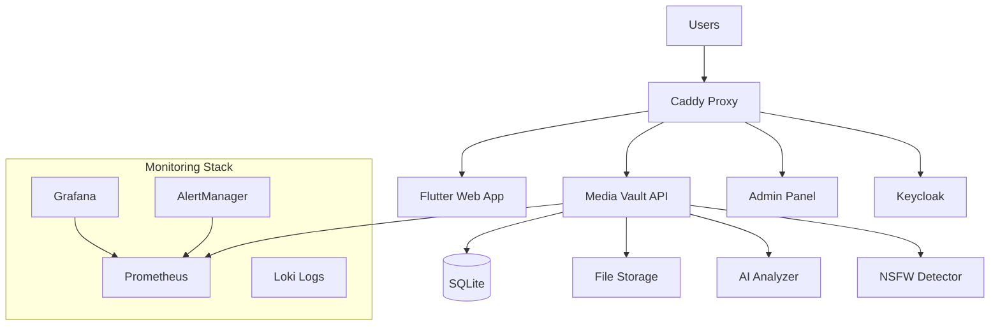

# 🔐 Media Vault - Complete Solution

**Enterprise-grade secure media storage with AI analysis, role-based access, and comprehensive monitoring.**

[](https://github.com/wronai/docker-platform)
[](LICENSE)
[](docker-compose.yml)

## 🎯 **Features Overview**

### 👤 **User Features**
- 🔐 **Keycloak SSO Authentication** - Secure single sign-on
- 📸 **Photo Upload & Management** - Drag & drop photo uploads
- 🤖 **AI-Powered Descriptions** - Automatic image content analysis
- 📝 **Manual Description Editing** - Enhance AI-generated descriptions
- 🖼️ **Personal Gallery** - Organized photo viewing
- 🔍 **Smart Search** - Find photos by description or metadata
- 📱 **Responsive Design** - Works on desktop and mobile

### 👨‍💼 **Admin Features**
- 👥 **User Management** - Add, edit, and manage users
- 📊 **System Analytics** - Performance and usage metrics
- 🛡️ **Security Monitoring** - Login attempts and threat detection
- 🔒 **Content Moderation** - Review and approve uploaded content
- ⚙️ **System Configuration** - Manage vault settings
- 📋 **Audit Logging** - Track all administrative actions
- 📈 **Grafana Dashboards** - Real-time system monitoring

### 🤝 **Partner Features**
- 📦 **Bulk Photo Upload** - Import hundreds of photos at once
- 🏷️ **Batch Description Management** - Edit multiple photo descriptions
- 📤 **Photo Sharing** - Share photos with specific users
- 👥 **User Access Control** - Manage photo permissions
- 📊 **Analytics Dashboard** - Track photo engagement and views
- 🔄 **Batch Operations** - Mass edit, delete, or share operations

### 🏗️ **Infrastructure Features**
- 📊 **Prometheus Metrics** - Comprehensive system monitoring
- 📈 **Grafana Dashboards** - Beautiful visualization
- 🚨 **AlertManager** - Intelligent alerting system
- 📝 **Centralized Logging** - Loki log aggregation
- 🔍 **Distributed Tracing** - Jaeger integration
- 🐳 **Container Monitoring** - Docker metrics with cAdvisor
- 🔒 **Security Scanning** - Automated vulnerability detection

---

## 🚀 **Quick Start (3 Commands)**

```bash
# 1. Clone and setup
git clone https://github.com/wronai/docker-platform
cd docker-platform

# 2. Start everything with monitoring
make full-stack-with-monitoring

# 3. Access the application
open http://localhost
```

**🌐 Service URLs:**
- **Main App**: http://localhost
- **Grafana**: http://localhost:3333 (admin/grafana123)
- **Prometheus**: http://localhost:9090
- **Keycloak**: http://localhost:8443/admin (admin/admin123)
- **AlertManager**: http://localhost:9093

**👤 Test Accounts:**
- **Admin**: vaultadmin / admin123
- **User**: vaultuser / user123

---

## 📋 **System Requirements**

- **Docker**: 20.10+
- **Docker Compose**: 2.0+
- **RAM**: 8GB+ recommended
- **Storage**: 50GB+ for media files
- **CPU**: 4+ cores recommended

---

## 🏗️ **Architecture Overview**




## 🔧 **Configuration**

### **Environment Variables (.env)**

```bash
# Vault Configuration
VAULT_NAME=MediaVault
ENVIRONMENT=production
DEBUG=false

# Authentication
KEYCLOAK_ADMIN_USER=admin
KEYCLOAK_ADMIN_PASSWORD=admin123
OAUTH2_ENABLED=true

# AI Features
AI_DESCRIPTION_ENABLED=true
NSFW_DETECTION_ENABLED=true

# Monitoring
GRAFANA_ADMIN_PASSWORD=grafana123
PROMETHEUS_PORT=9090
GRAFANA_PORT=3333

# Email Alerts
SMTP_HOST=smtp.gmail.com
SMTP_USER=alerts@mediavault.com
ADMIN_EMAIL=admin@mediavault.com

# Slack Integration
SLACK_WEBHOOK_URL=https://hooks.slack.com/services/YOUR/SLACK/WEBHOOK
```

### **Feature Flags**
- `AI_DESCRIPTION_ENABLED`: Enable/disable AI photo descriptions
- `NSFW_DETECTION_ENABLED`: Enable/disable content moderation
- `BULK_UPLOAD_ENABLED`: Enable/disable partner bulk uploads
- `PHOTO_SHARING_ENABLED`: Enable/disable photo sharing features

---

## 📊 **Monitoring & Observability**

### **Grafana Dashboards**
- **Infrastructure Overview** - System health and performance
- **Application Metrics** - API response times, user activity
- **Security Dashboard** - Authentication events, failed logins
- **Business Intelligence** - Photo uploads, user engagement

### **Prometheus Metrics**
- System metrics (CPU, memory, disk, network)
- Application metrics (API performance, upload rates)
- Security metrics (authentication events, threats)
- Business metrics (user activity, storage usage)

### **Alerting Rules**
- **Critical**: Service down, disk full, security breaches
- **Warning**: High resource usage, slow responses
- **Info**: Successful deployments, maintenance events

### **Access Monitoring**
```bash
# View real-time metrics
make prometheus           # http://localhost:9090

# Access dashboards
make grafana             # http://localhost:3333

# Check alerts
make alerts              # http://localhost:9093

# System health
make health-check-full   # Comprehensive health check
```

---

## 🎛️ **Management Commands**

### **Basic Operations**
```bash
make up                  # Start main application
make down                # Stop all services
make logs                # Show application logs
make status              # Show service status
make restart-api         # Restart API service
```

### **Monitoring**
```bash
make monitoring          # Start monitoring stack
make monitoring-logs     # Show monitoring logs
make backup-monitoring   # Backup monitoring data
make test-alerts         # Test alert system
```

### **Authentication**
```bash
make setup-keycloak      # Configure Keycloak
make keycloak-clean      # Reset Keycloak
```

### **Maintenance**
```bash
make backup-now          # Create system backup
make cleanup-all         # Clean unused resources
make load-test-monitored # Performance testing
make security-scan       # Security vulnerability scan
```

---

## 🔒 **Security Features**

### **Authentication & Authorization**
- **Keycloak SSO** - Enterprise-grade identity management
- **JWT Tokens** - Secure API authentication
- **Role-based Access** - User, Admin, Partner roles
- **Session Management** - Secure session handling

### **Content Security**
- **NSFW Detection** - Automatic content moderation
- **File Validation** - Type and size restrictions
- **Virus Scanning** - Malware protection (configurable)
- **Encryption** - File encryption at rest

### **Infrastructure Security**
- **Container Security** - Trivy vulnerability scanning
- **Network Policies** - Segmented container networking
- **Security Headers** - HTTPS, HSTS, CSP headers
- **Audit Logging** - Comprehensive activity tracking

### **Monitoring Security**
- **Failed Login Detection** - Brute force protection
- **Suspicious Activity Alerts** - Real-time threat detection
- **IP Blocking** - Automatic threat response
- **Security Dashboards** - Visual threat monitoring

---

## 🗂️ **Project Structure**

```
media-vault/
├── 📄 docker-compose.yml                    # Main application stack
├── 📄 docker-compose.monitoring.yml         # Monitoring stack
├── 📄 .env                                  # Environment configuration
├── 📄 Makefile                              # Management commands
│
├── 🔒 media-vault-backend/                  # Go API Backend
├── 🎨 flutter_frontend/                     # Flutter Web Application
├── ⚙️ media-vault-admin/                    # Admin Panel
├── 🔍 media-vault-analyzer/                 # AI Processing Service
├── 🤖 nsfw-analyzer/                        # Content Moderation
│
├── 📊 monitoring/                           # Monitoring Configuration
│   ├── prometheus/                          # Metrics collection
│   ├── grafana/                             # Dashboards
│   ├── alertmanager/                        # Alert routing
│   └── loki/                                # Log aggregation
│
├── 🔐 keycloak/                             # Authentication
├── 🌐 caddy/                                # Reverse proxy
├── 📝 scripts/                              # Automation scripts
└── 📋 docs/                                 # Documentation
```

---

## 🔄 **Development Workflow**

### **Local Development**
```bash
# Start development environment
make dev-start

# Run tests
make test

# Check code quality
make lint

# Build all components
make build
```

### **Code Standards**
- **Go**: gofmt, golint, go vet
- **Flutter**: dart format, flutter analyze
- **Docker**: Dockerfile best practices
- **Security**: Regular vulnerability scans

---

## 🚀 **Production Deployment**

### **Docker Swarm**
```bash
# Initialize swarm
docker swarm init

# Deploy stack
docker stack deploy -c docker-compose.yml media-vault
```

### **Kubernetes**
```bash
# Apply manifests
kubectl apply -f deployment/kubernetes/

# Check status
kubectl get pods -n media-vault
```

### **Production Checklist**
- [ ] Change default passwords
- [ ] Configure SSL certificates
- [ ] Set up external backups
- [ ] Configure monitoring alerts
- [ ] Review security settings
- [ ] Test disaster recovery

---

## 📈 **Performance Optimization**

### **Recommended Settings**
- **API**: 2-4 replicas, 1GB RAM each
- **Database**: SSD storage, regular backups
- **File Storage**: CDN for media delivery
- **Monitoring**: 30-day retention, efficient queries

### **Scaling Guidelines**
- **Horizontal Scaling**: Add API replicas for more users
- **Vertical Scaling**: Increase resources for AI processing
- **Storage Scaling**: Use external object storage (S3, MinIO)
- **Database Scaling**: Consider PostgreSQL for large datasets

---

## 🤝 **Contributing**

1. Fork the repository
2. Create a feature branch (`git checkout -b feature/amazing-feature`)
3. Commit changes (`git commit -m 'Add amazing feature'`)
4. Push to branch (`git push origin feature/amazing-feature`)
5. Open a Pull Request

---

## 📄 **License**

This project is licensed under the MIT License - see the [LICENSE](LICENSE) file for details.

---

## 🆘 **Support**

- **Documentation**: [docs/](docs/)
- **Issues**: [GitHub Issues](https://github.com/wronai/docker-platform/issues)
- **Discussions**: [GitHub Discussions](https://github.com/wronai/docker-platform/discussions)
- **Email**: support@mediavault.com

---

## 🎉 **Acknowledgments**

- **Flutter Team** - Amazing web framework
- **Keycloak** - Robust authentication
- **Prometheus/Grafana** - Excellent monitoring
- **Docker** - Containerization platform
- **Go Community** - Fast backend development

---

**Media Vault** - *Secure, intelligent, and scalable media management for the modern enterprise.*


# 🏗️ Media Vault - Complete Infrastructure Administration Guide

## 🎯 **Executive Summary**

Media Vault Infrastructure provides **enterprise-grade** monitoring, alerting, automation, and management capabilities:

- **📊 360° Monitoring** - Metrics, logs, tracing, alerts
- **🤖 Automated Incident Response** - Self-healing capabilities
- **🔮 Predictive Analytics** - Capacity planning & forecasting
- **🛡️ Security & Compliance** - Automated scanning & response
- **⚡ Performance Optimization** - Automated tuning & scaling

---

## 🚀 **Quick Start (3 Commands)**

```bash
# 1. Setup infrastructure
make infrastructure

# 2. Start with authentication  
make full-stack

# 3. Check status
make infra-status
```

**🌐 Access Points:**
- **Main App**: http://localhost
- **Grafana**: http://localhost:3333 (admin/grafana123)
- **Prometheus**: http://localhost:9090
- **Portainer**: http://localhost:9000
- **AlertManager**: http://localhost:9093

---

## 📊 **Monitoring Stack**

### **Core Metrics (Prometheus)**
```yaml
System Metrics:
  ✅ CPU usage per container and host
  ✅ Memory utilization and pressure
  ✅ Disk space and I/O performance
  ✅ Network traffic and errors
  ✅ Container lifecycle events

Application Metrics:
  ✅ API response times (95th percentile)
  ✅ Request rates and error rates  
  ✅ Database query performance
  ✅ Upload success/failure rates
  ✅ Authentication events (Keycloak)

Business Metrics:
  ✅ Active users and sessions
  ✅ Storage utilization trends
  ✅ Content analysis results
  ✅ Security incident counts
```

### **Visualization (Grafana)**
```yaml
Dashboards Available:
  📊 Infrastructure Overview - System health
  📈 Application Performance - API metrics  
  🔐 Security Dashboard - Auth & threats
  💾 Storage Analytics - Vault usage
  🐳 Container Monitoring - Docker stats
  📡 Network Analysis - Traffic patterns
  🎯 Business Intelligence - KPIs
```

### **Advanced Logging**
```yaml
Log Aggregation Options:
  🪵 Loki + Promtail (Lightweight)
    - Container logs centralization
    - Grafana integration
    - Label-based querying
    
  📊 ELK Stack (Advanced)
    - Elasticsearch search
    - Kibana visualization  
    - Advanced analytics
    - Full-text search
```

---

## 🚨 **Advanced Alerting System**

### **Alert Categories**
```yaml
🔴 CRITICAL (Immediate Action):
  - Service completely down (>1 min)
  - Disk will fill in 4 hours
  - Database connection exhaustion
  - Security breach indicators

🟡 WARNING (Investigation Required):
  - High resource usage (>80% for 5 min)
  - API response time degraded (>5s)
  - Failed login spike (>20 in 5 min)
  - Memory pressure (>85%)

🔵 INFO (Monitoring):
  - Scheduled maintenance
  - Performance optimizations
  - Backup completion
  - Certificate renewals
```

### **Notification Channels**
```yaml
Alert Delivery:
  📧 Email - admin@mediavault.com
  💬 Slack - #alerts, #warnings channels
  📱 PagerDuty - Critical issues only
  📊 Grafana - Dashboard notifications
  🔔 Teams - Alternative to Slack
```

### **Automated Responses**
```yaml
Self-Healing Actions:
  🔄 Service restart for container failures
  🧹 Automatic cleanup for disk space
  ⚡ Resource rebalancing for high usage
  🛡️ Security lockdown for threats
  📊 Performance optimization triggers
```

---

## 🤖 **Intelligent Automation**

### **Incident Response Automation**
```bash
# Automated actions for common issues:
Service Down → Docker restart → Health check → Notify
High Memory → Clear caches → Restart services → Monitor
Disk Full → Cleanup logs → Docker prune → Expand if needed
Security