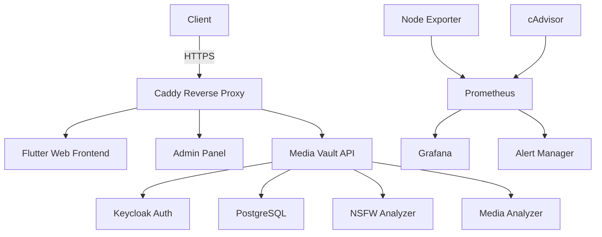
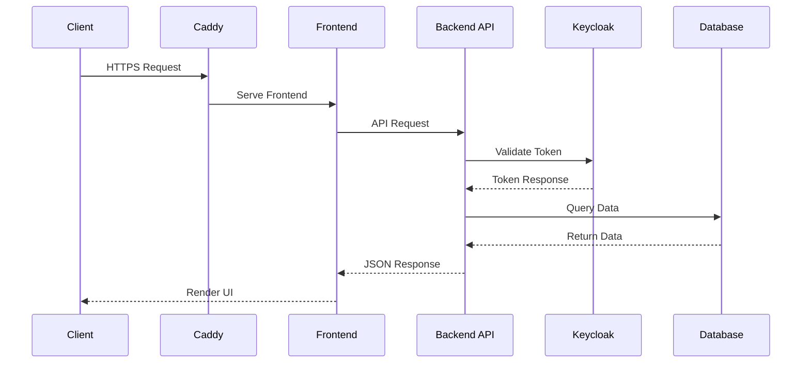

# 🔐 Media Vault - Complete Solution

**Enterprise-grade secure media storage with AI analysis, role-based access, and comprehensive monitoring.**

[](https://github.com/wronai/docker-platform)
[](LICENSE)
[](docker-compose.yml)
[](#documentation)
[](#project-status)

## 📋 Table of Contents
- [🚀 Features](#-features)
- [🏗️ System Architecture](#system-architecture)
- [📦 Project Structure](#project-structure)
- [🚀 Getting Started](#getting-started)
- [🔧 Configuration](#configuration)
- [🛠️ Development](#development)
- [🧪 Testing](#testing)
- [📊 Monitoring](#monitoring)
- [🔐 Authentication](#authentication)
- [📚 Documentation](#documentation)
- [🤝 Contributing](#contributing)
- [📄 License](#license)

## 🚀 Features

### Core Features
- **Secure File Storage**: Encrypted at rest and in transit
- **Role-Based Access Control**: Fine-grained permissions system
- **AI-Powered Analysis**: Automatic content moderation and tagging
- **High Availability**: Distributed architecture for reliability
- **Comprehensive Monitoring**: Built-in observability stack

### Technical Highlights
- **Containerized Microservices**: Easy deployment with Docker
- **Scalable Architecture**: Horizontally scalable components
- **Modern Tech Stack**: Built with Go, Flutter, and Keycloak
- **CI/CD Ready**: Automated testing and deployment pipelines
- **Infrastructure as Code**: Reproducible environments

## 🏗️ System Architecture

### High-Level Overview



### Component Interactions



## 📦 Project Structure

```
docker-platform/
├── ansible/               # Infrastructure as Code
├── caddy/                 # Reverse proxy configuration
├── data/                  # Persistent data
├── deployment/            # Deployment configurations
├── docs/                  # Documentation
├── flutter_frontend/      # Flutter web interface
├── keycloak/             # Authentication service
│   ├── themes/           # Custom UI themes
│   └── import/           # Initial data import
├── media-vault-admin/     # Admin dashboard
├── media-vault-analyzer/  # Media analysis service
├── media-vault-backend/   # Core API service
│   ├── cmd/              # Application entry points
│   ├── internal/         # Private application code
│   │   ├── auth/         # Authentication
│   │   ├── handlers/     # HTTP handlers
│   │   └── services/     # Business logic
│   └── pkg/              # Public libraries
├── monitoring/           # Monitoring stack
├── nsfw-analyzer/        # NSFW detection service
├── scripts/              # Utility scripts
└── tests/                # Test suites
```

## 🚀 Getting Started

### Prerequisites

- Docker 20.10+ and Docker Compose
- 4GB RAM minimum (8GB recommended for development)
- Ports 80, 443, 8080, 3000 available

### Quick Start

1. Clone the repository:
   ```bash
   git clone https://github.com/wronai/docker-platform.git
   cd docker-platform
   ```

2. Set up environment variables:
   ```bash
   cp .env.example .env
   # Edit .env with your configuration
   ```

3. Start the stack:
   ```bash
   make up
   ```

4. Access the applications:
   - Web UI: https://localhost
   - Admin Panel: https://admin.localhost
   - Keycloak: https://auth.localhost
   - Grafana: http://localhost:3000

## 🔧 Configuration

### Environment Variables

Key configuration files:
- `.env` - Main environment variables
- `docker-compose.yml` - Core services
- `docker-compose.monitoring.yml` - Monitoring stack
- `caddy/Caddyfile` - Reverse proxy configuration
- `keycloak/import/realm-export.json` - Keycloak realm configuration

### Service Ports

| Service     | Port  | Description                     |
|-------------|-------|---------------------------------|
| Frontend    | 80/443| Web interface                   |
| Keycloak    | 8080  | Authentication service          |
| Grafana     | 3000  | Monitoring dashboards           |
| Prometheus  | 9090  | Metrics collection              |
| Alertmanager| 9093  | Alert management                |
| cAdvisor    | 8081  | Container metrics               |
| Node Exporter| 9100 | Host metrics                    |

### Important Configuration Files

- **Backend**: `media-vault-backend/configs/config.yaml`
- **Frontend**: `flutter_frontend/lib/config.dart`
- **Monitoring**: `monitoring/grafana/provisioning/`
- **Authentication**: `keycloak/import/realm-export.json`

## 🛠️ Development

### Development Workflow

1. Start development environment:
   ```bash
   make dev
   ```

2. Run specific services:
   ```bash
   make up backend frontend
   ```

3. View logs:
   ```bash
   make logs service=backend
   ```

### Common Tasks

```bash
# Build all services
make build

# Run tests
make test

# Run linters
make lint

# Format code
make format

# Update dependencies
make deps
```

## 🧪 Testing

### Running Tests

```bash
# Run unit tests
make test-unit

# Run integration tests
make test-integration

# Run end-to-end tests
make test-e2e
```

### Test Coverage

```bash
# Generate coverage report
make coverage

# View HTML coverage report
make coverage-html
```

## 📊 Monitoring

### Access Monitoring Tools

- **Grafana**: http://localhost:3000 (admin/admin)
- **Prometheus**: http://localhost:9090
- **Alertmanager**: http://localhost:9093

### Key Metrics

- API response times
- Error rates
- Resource usage
- User activity
- Storage utilization

## 🔐 Authentication

### Keycloak Setup

1. Access Keycloak admin console: https://auth.localhost/admin
2. Log in with admin credentials
3. Import realm configuration from `keycloak/import/realm-export.json`
4. Configure identity providers and clients as needed

### User Management

- Create users in Keycloak admin console
- Assign roles and permissions
- Set up password policies
- Configure multi-factor authentication

## 📚 Documentation

### API Documentation

Access the interactive API documentation at:
- Swagger UI: https://localhost/api/docs
- OpenAPI Spec: https://localhost/api/docs.json

### Additional Resources

- [Developer Guide](docs/DEVELOPER_GUIDE.md)
- [API Reference](docs/API_REFERENCE.md)
- [Deployment Guide](docs/DEPLOYMENT.md)
- [Troubleshooting](docs/TROUBLESHOOTING.md)

## 🤝 Contributing

1. Fork the repository
2. Create a feature branch (`git checkout -b feature/AmazingFeature`)
3. Commit your changes (`git commit -m 'Add some AmazingFeature'`)
4. Push to the branch (`git push origin feature/AmazingFeature`)
5. Open a Pull Request

## 📄 License

This project is licensed under the Apache License 2.0 - see the [LICENSE](LICENSE) file for details.

## 🙏 Acknowledgments

- [Keycloak](https://www.keycloak.org/) for authentication
- [Fiber](https://gofiber.io/) for the Go web framework
- [Flutter](https://flutter.dev/) for the frontend
- [Prometheus](https://prometheus.io/) and [Grafana](https://grafana.com/) for monitoring
