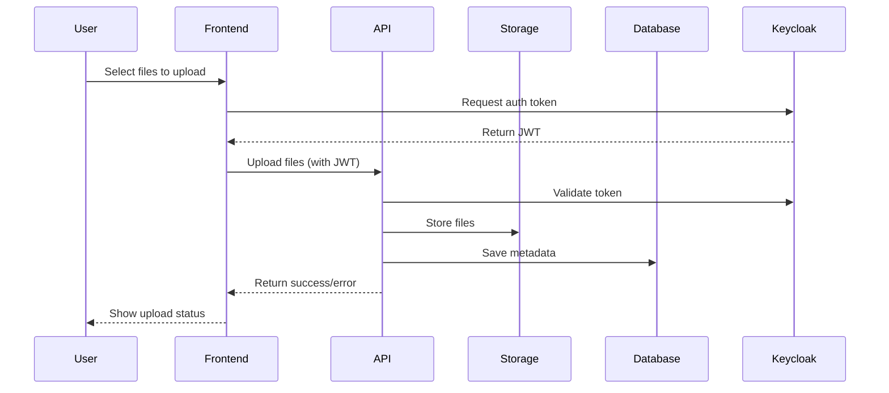
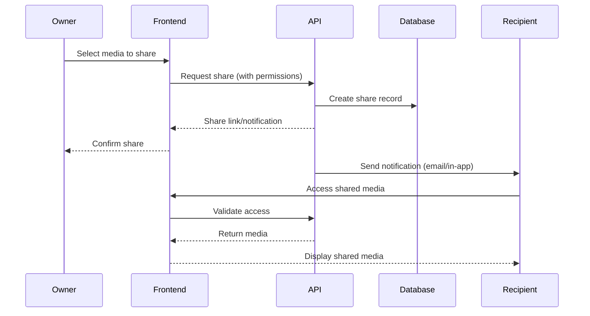
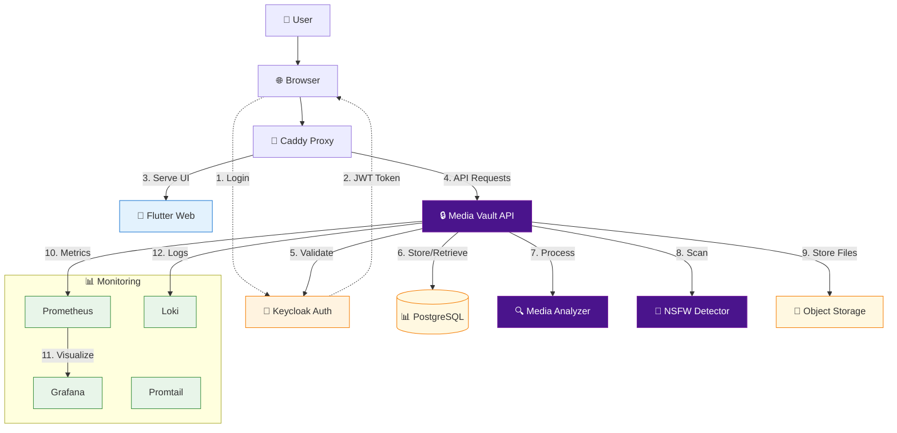
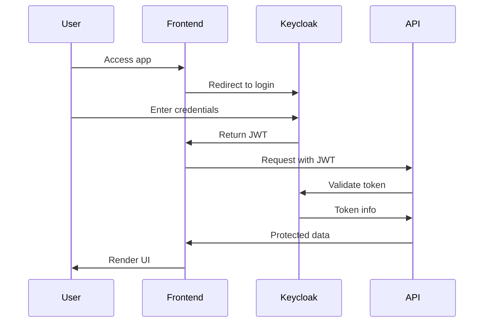

# 🏗️ Media Vault - Architecture Reference

## 🌐 System Architecture

This document provides a comprehensive overview of the Media Vault system architecture, including its components, data flow, user roles, and design decisions.

## 👥 User Roles

### 1. End User
- **Permissions**:
  - Upload and manage personal media
  - View and edit own media metadata
  - Share media with other users
  - Generate AI descriptions for media
  - View personal analytics

### 2. Partner User
- **Permissions**:
  - All End User permissions
  - Access to partner-specific media
  - Manage media shared with partner organization
  - View partner-level analytics

### 3. Administrator
- **Permissions**:
  - All Partner User permissions
  - Manage system users and roles
  - Configure system settings
  - Access system-wide analytics
  - Perform system maintenance

## 🔄 Key User Flows

### 1. Media Upload Flow


### 2. Media Sharing Flow


## 🏗 System Components

### 1. Frontend (Flutter Web)
- Responsive web interface
- Media upload and management
- Real-time updates
- Authentication flows

### 2. Backend Services
- **API Gateway**: Request routing and authentication
- **Media Service**: File processing and storage
- **Metadata Service**: Media metadata management
- **AI Service**: Media analysis and description
- **Sharing Service**: Access control and sharing

### 3. Data Storage
- **PostgreSQL**: Relational data
- **Object Storage**: Media files
- **Redis**: Caching and sessions

### 4. Infrastructure
- **Docker & Docker Compose**: Containerization
- **Caddy**: Reverse proxy
- **Keycloak**: Authentication/Authorization
- **Monitoring Stack**: Prometheus, Grafana, Loki

## 🚀 Deployment Architecture

### Development Environment
- Local Docker Compose setup
- Hot-reload for development
- Local database instances

### Production Environment
- Container orchestration (Kubernetes)
- High availability
- Automated backups
- Monitoring and alerting

## 🔄 Data Flow

1. **Authentication**: User authenticates via Keycloak
2. **Request Processing**: Caddy routes requests to appropriate service
3. **Business Logic**: Backend services process requests
4. **Data Persistence**: Data is stored in appropriate storage
5. **Response**: Results are returned to the frontend

## 🛡️ Security Considerations

- All communications use HTTPS
- JWT-based authentication
- Role-based access control (RBAC)
- Input validation and sanitization
- Regular security audits

## 📈 Scaling Strategy

- Horizontal scaling for stateless services
- Database read replicas
- CDN for media delivery
- Caching layer for frequent queries

## 🔄 CI/CD Pipeline

1. Code commit triggers build
2. Run tests
3. Build Docker images
4. Deploy to staging
5. Run integration tests
6. Deploy to production

## 📋 Compliance

- GDPR compliance for user data
- Data retention policies
- Audit logging
- Regular backups

## 🔄 Error Handling

- Centralized error logging
- Graceful degradation
- User-friendly error messages
- Automatic retries for transient failures

## 📚 API Documentation

See [API Documentation](./API.md) for detailed API specifications and examples.

### High-Level Architecture



## 🧱 Core Components

### 1. Frontend (Flutter Web)
- **Responsive UI**: Works on all devices
- **Progressive Web App (PWA)**: Installable on desktop/mobile
- **State Management**: Provider/Riverpod
- **Theming**: Light/Dark mode support

### 2. API Layer (Go + Fiber)
- **RESTful API**: JSON-based endpoints
- **Authentication**: JWT validation with Keycloak
- **Rate Limiting**: Protect against abuse
- **Request Validation**: Input sanitization
- **Documentation**: OpenAPI/Swagger

### 3. Authentication (Keycloak)
- **Single Sign-On (SSO)**: Support for OAuth2/OIDC
- **Multi-Factor Auth**: TOTP, WebAuthn
- **User Federation**: LDAP, Active Directory
- **Role-Based Access Control (RBAC)**: Fine-grained permissions

### 4. Media Processing
- **File Analysis**: Extract metadata
- **Thumbnail Generation**: For images and videos
- **Content Moderation**: NSFW detection
- **Format Conversion**: Transcoding to web-friendly formats

### 5. Storage
- **Object Storage**: S3-compatible (MinIO)
- **Encryption**: At-rest and in-transit
- **Versioning**: File history and rollback
- **Replication**: Cross-region replication for DR

### 6. Monitoring & Observability
- **Metrics**: Prometheus
- **Visualization**: Grafana dashboards
- **Logging**: Loki + Promtail
- **Alerting**: Alertmanager

## 🔄 Data Flow

### File Upload Process
1. User authenticates and gets JWT
2. Client requests signed upload URL from API
3. Client uploads file directly to storage
4. API processes the file asynchronously
5. Metadata is stored in database
6. User receives upload confirmation

### Authentication Flow


## 🚀 Infrastructure Administration

Below is the detailed infrastructure stack that powers Media Vault:

### 📊 Complete Infrastructure Stack

```ascii
                    🏗️ INFRASTRUCTURE OVERVIEW
┌─────────────────────────────────────────────────────────────────────┐
│                          MONITORING LAYER                          │
│  ┌─────────────┐ ┌─────────────┐ ┌─────────────┐ ┌─────────────┐   │
│  │  Prometheus │ │   Grafana   │ │AlertManager │ │   Jaeger    │   │
│  │ :9090       │ │ :3333       │ │ :9093       │ │ :16686      │   │
│  │ Metrics     │ │ Dashboards  │ │ Alerts      │ │ Tracing     │   │
│  └─────────────┘ └─────────────┘ └─────────────┘ └─────────────┘   │
└─────────────────────────────────────────────────────────────────────┘

## 📊 Complete Infrastructure Stack

```ascii
                    🏗️ INFRASTRUCTURE OVERVIEW
┌─────────────────────────────────────────────────────────────────────┐
│                          MONITORING LAYER                          │
│  ┌─────────────┐ ┌─────────────┐ ┌─────────────┐ ┌─────────────┐   │
│  │  Prometheus │ │   Grafana   │ │AlertManager │ │   Jaeger    │   │
│  │ :9090       │ │ :3333       │ │ :9093       │ │ :16686      │   │
│  │ Metrics     │ │ Dashboards  │ │ Alerts      │ │ Tracing     │   │
│  └─────────────┘ └─────────────┘ └─────────────┘ └─────────────┘   │
└─────────────────────────────────────────────────────────────────────┘
┌─────────────────────────────────────────────────────────────────────┐
│                           LOGGING LAYER                            │
│  ┌─────────────┐ ┌─────────────┐ ┌─────────────┐ ┌─────────────┐   │
│  │    Loki     │ │  Promtail   │ │    ELK      │ │  FileBeat   │   │
│  │ :3100       │ │ Log Ship    │ │ :5601       │ │ Log Ship    │   │
│  │ Log Aggreg  │ │             │ │ Advanced    │ │             │   │
│  └─────────────┘ └─────────────┘ └─────────────┘ └─────────────┘   │
└─────────────────────────────────────────────────────────────────────┘
┌─────────────────────────────────────────────────────────────────────┐
│                         MANAGEMENT LAYER                           │
│  ┌─────────────┐ ┌─────────────┐ ┌─────────────┐ ┌─────────────┐   │
│  │  Portainer  │ │  pgAdmin    │ │Redis Cmd    │ │ Watchtower  │   │
│  │ :9000       │ │ :5050       │ │ :8081       │ │ Auto Update │   │
│  │ Docker Mgmt │ │ DB Admin    │ │ Redis Mgmt  │ │             │   │
│  └─────────────┘ └─────────────┘ └─────────────┘ └─────────────┘   │
└─────────────────────────────────────────────────────────────────────┘
┌─────────────────────────────────────────────────────────────────────┐
│                         SECURITY & BACKUP                          │
│  ┌─────────────┐ ┌─────────────┐ ┌─────────────┐ ┌─────────────┐   │
│  │   Traefik   │ │ Nginx Proxy │ │   Backup    │ │  Security   │   │
│  │ :8080       │ │ :8181       │ │ Service     │ │ Scanner     │   │
│  │ Load Bal    │ │ Proxy Mgmt  │ │ Automated   │ │ Trivy       │   │
│  └─────────────┘ └─────────────┘ └─────────────┘ └─────────────┘   │
└─────────────────────────────────────────────────────────────────────┘
```

## 🚀 Quick Start Commands

### **Infrastructure Deployment:**
```bash
# Full infrastructure stack
make infrastructure

# Basic monitoring only
make monitoring  

# Everything (Vault + Infrastructure)
make full-stack

# Specialized stacks
make infra-elk      # Elasticsearch + Kibana
make infra-traefik  # Traefik load balancer
make infra-nginx    # Nginx Proxy Manager
```

### **Management Commands:**
```bash
# Status and health
make infra-status   # Infrastructure status
make health-check   # Health check all services
make dev-logs       # Development logs

# Performance and security
make load-test      # K6 performance testing
make security-scan  # Trivy vulnerability scan
make performance-report  # Generate report

# Backup and maintenance
make backup-now     # Immediate backup
make cleanup-all    # Clean unused resources
```

## 📊 Monitoring & Observability

### **Prometheus Metrics:**
- ✅ **System metrics** (CPU, Memory, Disk, Network)
- ✅ **Container metrics** (Docker stats via cAdvisor)
- ✅ **Application metrics** (API response times, errors)
- ✅ **Keycloak metrics** (authentication events)
- ✅ **Custom alerts** (service down, high resource usage)

### **Grafana Dashboards:**
- 📊 **Infrastructure Overview** - System health
- 📈 **Application Performance** - API metrics
- 🔐 **Security Dashboard** - Auth events
- 💾 **Storage Analytics** - Vault usage
- 🐳 **Container Monitoring** - Docker stats

### **Alert Definitions:**
```yaml
Critical Alerts:
  - Service Down (> 1 min)
  - Disk Space < 10%
  - Memory Usage > 90%
  - Failed Login Spike

Warning Alerts:
  - High CPU (> 80%, 5 min)
  - Response Time > 2s
  - Memory Usage > 85%
```

## 🏗️ Infrastructure Components

### **Core Monitoring:**
| Service | Port | Purpose | Dashboard |
|---------|------|---------|-----------|
| **Prometheus** | 9090 | Metrics collection | http://localhost:9090 |
| **Grafana** | 3333 | Visualization | http://localhost:3333 |
| **AlertManager** | 9093 | Alert management | http://localhost:9093 |
| **Node Exporter** | 9100 | Host metrics | http://localhost:9100 |
| **cAdvisor** | 8888 | Container metrics | http://localhost:8888 |

### **Advanced Logging:**
| Service | Port | Purpose | Dashboard |
|---------|------|---------|-----------|
| **Loki** | 3100 | Log aggregation | via Grafana |
| **Promtail** | - | Log shipping | - |
| **Elasticsearch** | 9200 | Search & analytics | http://localhost:9200 |
| **Kibana** | 5601 | Log visualization | http://localhost:5601 |
| **Jaeger** | 16686 | Distributed tracing | http://localhost:16686 |

### **Management Tools:**
| Service | Port | Purpose | Dashboard |
|---------|------|---------|-----------|
| **Portainer** | 9000 | Docker management | http://localhost:9000 |
| **pgAdmin** | 5050 | PostgreSQL admin | http://localhost:5050 |
| **Redis Commander** | 8081 | Redis management | http://localhost:8081 |
| **Traefik** | 8080 | Load balancer | http://localhost:8080 |

## 🔒 Security & Compliance

### **Security Features:**
- 🛡️ **Container scanning** with Trivy
- 🔐 **Secret management** via Docker secrets
- 🌐 **Network policies** and segmentation
- 📝 **Audit logging** for all admin actions
- 🚨 **Intrusion detection** alerts

### **Backup Strategy:**
- 📅 **Automated daily backups** at 2 AM
- ☁️ **S3 upload** for off-site storage
- 🔄 **30-day retention** policy
- 🗜️ **Compressed archives** with encryption
- ✅ **Backup verification** checks

### **Production Security:**
```yaml
Security Headers:
  - Strict-Transport-Security
  - X-Content-Type-Options: nosniff
  - X-Frame-Options: DENY
  - Referrer-Policy: strict-origin

Rate Limiting:
  - 100 requests/minute per IP
  - Admin panel IP restriction
  - API throttling enabled
```

## 📈 Performance Optimization

### **Resource Monitoring:**
- 📊 **Real-time dashboards** 
- ⚡ **Performance alerts**
- 🎯 **SLA monitoring** (99.9% uptime)
- 📉 **Trend analysis**

### **Auto-scaling:**
- 🔄 **HPA** for API services
- 📈 **Load balancing** with Traefik
- 🎛️ **Resource limits** per container
- ⚖️ **Dynamic scaling** based on metrics

### **Performance Testing:**
```bash
# K6 load testing
make load-test

# Response time monitoring
curl -w "@curl-format.txt" http://localhost:8080/health

# Resource usage
docker stats --format "table {{.Name}}\t{{.CPUPerc}}\t{{.MemUsage}}"
```

## 🚨 Incident Response

### **Alert Channels:**
- 📧 **Email notifications** to admin
- 💬 **Slack integration** for team alerts
- 📱 **PagerDuty** for critical issues
- 📊 **Dashboard notifications**

### **Runbooks:**
1. **Service Down:**
   ```bash
   make health-check     # Identify failed service
   docker-compose restart <service>
   make dev-logs        # Check logs
   ```

2. **High Resource Usage:**
   ```bash
   make performance-report  # Generate report
   docker stats            # Check current usage
   make cleanup-all        # Clean resources
   ```

3. **Security Incident:**
   ```bash
   make security-scan      # Vulnerability check
   docker-compose logs     # Review access logs
   # Block suspicious IPs in Caddy/Traefik
   ```

## 🎛️ Administration Workflows

### **Daily Operations:**
- ✅ Check health dashboard
- 📊 Review performance metrics
- 🔍 Scan security alerts
- 💾 Verify backup completion

### **Weekly Tasks:**
- 📈 Performance report review
- 🛡️ Security scan execution
- 🧹 Resource cleanup
- 📋 Capacity planning review

### **Monthly Maintenance:**
- 🔄 Update container images
- 📊 SLA report generation
- 🗄️ Backup retention cleanup
- 🔐 Security audit review

## 💡 Pro Tips

### **Optimization:**
- Use **profiles** for different environments
- Enable **automatic updates** with Watchtower
- Set up **custom metrics** for business logic
- Implement **circuit breakers** for resilience

### **Troubleshooting:**
- Always check **logs first**: `make dev-logs`
- Use **health endpoints** for service status
- Monitor **resource usage** trends
- Keep **runbooks updated** for common issues

This infrastructure setup provides **enterprise-grade** monitoring, security, and management capabilities for Media Vault! 🚀