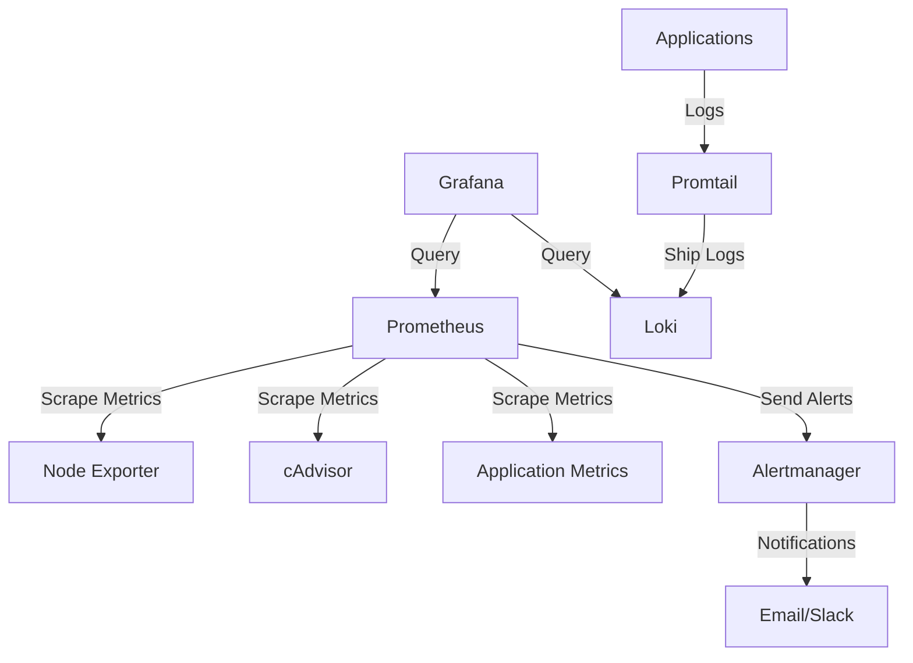

# 📊 Monitoring & Observability Guide

This document provides a comprehensive guide to monitoring the Media Vault platform using the built-in observability stack.

## Table of Contents
- [Monitoring Stack](#-monitoring-stack)
- [Accessing Dashboards](#-accessing-dashboards)
- [Key Metrics](#-key-metrics)
- [Alerting](#-alerting)
- [Log Management](#-log-management)
- [Performance Tuning](#-performance-tuning)
- [Troubleshooting](#-troubleshooting)

## 🛠️ Monitoring Stack

Media Vault uses a modern observability stack:



### Components

| Component | Description | Port |
|-----------|-------------|------|
| **Prometheus** | Metrics collection and storage | 9090 |
| **Grafana** | Visualization and dashboards | 3000 |
| **Alertmanager** | Alert routing and deduplication | 9093 |
| **Node Exporter** | Host-level metrics | 9100 |
| **cAdvisor** | Container metrics | 8080 |
| **Loki** | Log aggregation | 3100 |
| **Promtail** | Log shipping | - |


## 🖥️ Accessing Dashboards

### Grafana
- **URL**: http://localhost:3000
- **Default Credentials**:
  - Username: `admin`
  - Password: `admin` (change on first login)

### Prometheus
- **URL**: http://localhost:9090
- **API**: http://localhost:9090/api/v1/query

### Alertmanager
- **URL**: http://localhost:9093

## 📈 Key Metrics

### Infrastructure Metrics
- **CPU Usage**: `rate(node_cpu_seconds_total[5m])`
- **Memory Usage**: `node_memory_MemTotal_bytes - node_memory_MemAvailable_bytes`
- **Disk I/O**: `rate(node_disk_read_bytes_total[5m])`
- **Network Traffic**: `rate(node_network_receive_bytes_total[5m])`

### Application Metrics
- **Request Rate**: `rate(http_requests_total[5m])`
- **Error Rate**: `rate(http_requests_total{status=~"5.."}[5m])`
- **Request Duration**: `histogram_quantile(0.95, sum(rate(http_request_duration_seconds_bucket[5m])) by (le))`
- **Active Users**: `sum(up{job=~"app.*"})`

### Database Metrics
- **Active Connections**: `pg_stat_activity_count`
- **Query Performance**: `rate(pg_stat_activity_queries_duration_seconds_sum[5m])`
- **Cache Hit Ratio**: `sum(rate(pg_stat_database_blks_hit[5m])) / sum(rate(pg_stat_database_blks_hit[5m])) + sum(rate(pg_stat_database_blks_read[5m]))`

## 🚨 Alerting

### Critical Alerts

| Alert | Description | Severity |
|-------|-------------|----------|
| HighErrorRate | Error rate > 5% | critical |
| HighLatency | p95 latency > 1s | critical |
| InstanceDown | Service down > 5m | critical |
| DiskSpaceLow | < 10% free space | warning |
| HighCPU | CPU > 90% for 5m | warning |

### Alert Configuration

Alert rules are defined in `monitoring/prometheus/alert.rules`:

```yaml
groups:
- name: instance
  rules:
  - alert: InstanceDown
    expr: up == 0
    for: 5m
    labels:
      severity: critical
    annotations:
      summary: "Instance {{ $labels.instance }} down"
      description: "{{ $labels.instance }} has been down for more than 5 minutes"
```

### Notification Channels
- Email
- Slack
- PagerDuty
- Webhooks

## 📝 Log Management

### Log Collection
- **Loki** aggregates logs from all services
- **Promtail** ships logs to Loki
- Structured logging in JSON format

### Querying Logs

```sql
# Find errors in the last hour
{job=~"app.+"} |= "error" | json | line_format "{{.message}}"

# Slow requests
{job="api"} | json | duration > 1s

# User activity
{job=~"app.+"} | json | user_id!=""
```

## ⚡ Performance Tuning

### Prometheus Configuration

```yaml
# Increase retention period
retention: 30d

# Configure scrape intervals
scrape_interval: 15s
evaluation_interval: 15s

# Enable remote write for long-term storage
remote_write:
  - url: http://remote-storage:8086/api/v1/push
```

### Resource Limits

```yaml
# docker-compose.override.yml
services:
  prometheus:
    deploy:
      resources:
        limits:
          cpus: '2'
          memory: 4G
```

## 🐛 Troubleshooting

### Common Issues

1. **No Data in Grafana**
   - Check Prometheus targets: http://localhost:9090/targets
   - Verify service discovery is working
   - Check Prometheus logs: `docker-compose logs prometheus`

2. **High Memory Usage**
   - Increase memory limits
   - Adjust retention periods
   - Optimize queries

3. **Alert Notifications Not Working**
   - Check Alertmanager configuration
   - Verify notification channels
   - Check Alertmanager logs

### Useful Commands

```bash
# Check Prometheus status
curl -s http://localhost:9090/-/healthy

# Query metrics directly
curl 'http://localhost:9090/api/v1/query?query=up'

# Check Promtail status
curl http://localhost:9080/metrics
```

## 🔄 Maintenance

### Backup & Restore

```bash
# Backup Prometheus data
docker run --rm -v prometheus_data:/source -v $(pwd):/backup alpine tar czf /backup/prometheus_backup.tar.gz -C /source .

# Restore
docker run --rm -v prometheus_data:/target -v $(pwd):/backup alpine sh -c "cd /target && tar xzf /backup/prometheus_backup.tar.gz"
```

### Upgrading

1. Backup all data
2. Check release notes for breaking changes
3. Update configuration files
4. Run migrations if needed
5. Restart services

## 📚 Additional Resources

- [Prometheus Documentation](https://prometheus.io/docs/)
- [Grafana Documentation](https://grafana.com/docs/)
- [Loki Documentation](https://grafana.com/docs/loki/latest/)
- [Alerting Best Practices](https://prometheus.io/docs/practices/alerting/)

For support, please contact the DevOps team or open an issue in our [GitHub repository](https://github.com/wronai/docker-platform/issues).