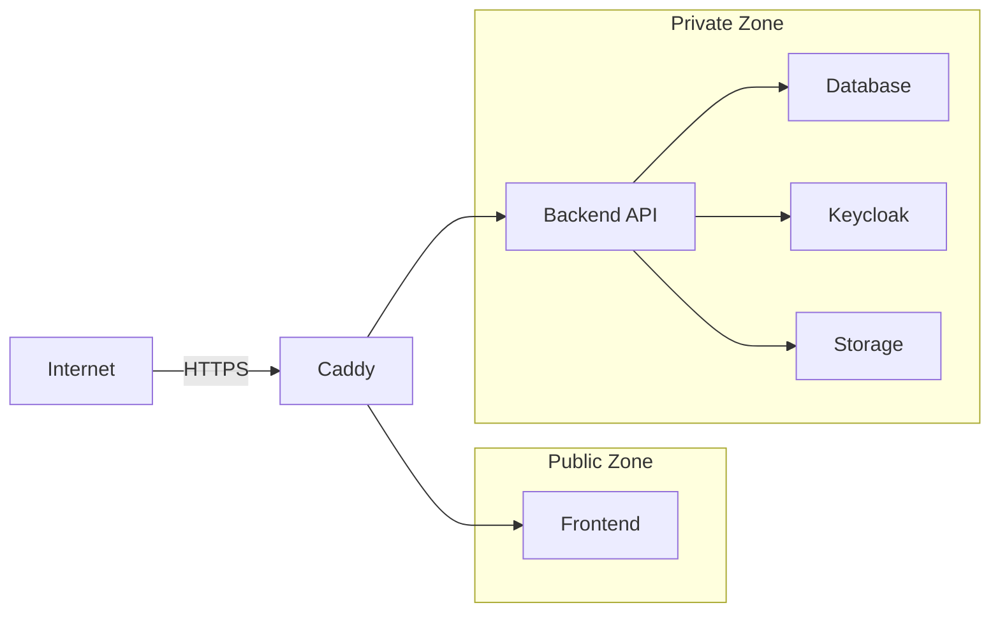

# 🔐 Security Guide

This document outlines the security measures and best practices for the Media Vault platform.

## Table of Contents
- [Security Overview](#-security-overview)
- [Authentication](#-authentication)
- [Authorization](#-authorization)
- [Data Protection](#-data-protection)
- [Network Security](#-network-security)
- [Vulnerability Management](#-vulnerability-management)
- [Incident Response](#-incident-response)
- [Compliance](#-compliance)
- [Security Best Practices](#-security-best-practices)

## 🛡️ Security Overview

Media Vault implements a defense-in-depth security strategy with multiple layers of protection:

1. **Perimeter Security**: Firewall, WAF, and DDoS protection
2. **Identity & Access Management**: Keycloak-based authentication
3. **Data Protection**: Encryption at rest and in transit
4. **Network Security**: VPCs, security groups, and network policies
5. **Monitoring & Logging**: Comprehensive audit trails

## 🔑 Authentication

### Keycloak Integration
- Centralized identity management
- Multi-factor authentication (MFA) support
- Social login (Google, GitHub, etc.)
- Password policies enforcement

### Session Management
- Secure, HTTP-only cookies
- Short-lived access tokens (15-30 minutes)
- Refresh token rotation
- Session timeout after 24 hours of inactivity

## 🔐 Authorization

### Role-Based Access Control (RBAC)

| Role | Permissions |
|------|-------------|
| Admin | Full system access |
| Manager | User management, content moderation |
| User | Upload, view, manage own content |
| Guest | Read-only access to public content |

### Attribute-Based Access Control (ABAC)
- Fine-grained permissions based on:
  - User attributes
  - Resource attributes
  - Environment conditions
  - Action types

## 🔒 Data Protection

### Encryption

| Data State | Encryption Method |
|------------|-------------------|
| In Transit | TLS 1.3 |
| At Rest | AES-256 |
| Database | TDE (Transparent Data Encryption) |
| Backups | GPG |

### Data Retention
- User data: Retained until account deletion
- Audit logs: 1 year
- System logs: 30 days
- Backups: 90 days

## 🌐 Network Security

### Network Segmentation

### Security Groups
- Restrict access to required ports only
- Implement IP whitelisting for admin interfaces
- Use security groups to control traffic between services

## 🕵️ Vulnerability Management

### Scanning
- **Container Images**: Daily vulnerability scans
- **Dependencies**: Weekly security updates
- **Infrastructure**: Monthly security assessments

### Patching
- Critical patches applied within 24 hours
- High severity patches within 7 days
- Regular updates for all dependencies

## 🚨 Incident Response

### Response Plan
1. **Detection**
   - Monitor security events
   - Set up alerts for suspicious activities

2. **Containment**
   - Isolate affected systems
   - Preserve evidence

3. **Eradication**
   - Identify root cause
   - Apply fixes

4. **Recovery**
   - Restore from clean backups
   - Verify system integrity

5. **Post-Mortem**
   - Document the incident
   - Implement preventive measures

## 📜 Compliance

### Standards & Regulations
- GDPR (General Data Protection Regulation)
- CCPA (California Consumer Privacy Act)
- SOC 2 Type II
- ISO 27001

### Security Certifications
- Regular third-party security audits
- Penetration testing bi-annually
- Compliance certification audits annually

## 🛠️ Security Best Practices

### For Developers
1. **Code Security**
   - Regular code reviews
   - Static code analysis
   - Dependency scanning

2. **Secrets Management**
   - Never commit secrets to version control
   - Use environment variables or secret managers
   - Rotate credentials regularly

3. **Secure Development**
   - Follow OWASP Top 10
   - Implement input validation
   - Use parameterized queries

### For System Administrators
1. **Hardening**
   - Disable unused services
   - Apply OS security patches
   - Configure firewalls

2. **Monitoring**
   - Centralized logging
   - Real-time alerting
   - Regular security audits

### For Users
1. **Account Security**
   - Use strong, unique passwords
   - Enable MFA
   - Regularly review account activity

2. **Data Handling**
   - Share sensitive data only when necessary
   - Be cautious with public sharing
   - Report suspicious activities

## 📝 Security Contact

To report security vulnerabilities, please email:
security@wron.ai

We respond to all reports within 24 hours and appreciate your help in keeping Media Vault secure.