# 📘 User Guide

Welcome to Media Vault! This guide will help you get started with using the platform to securely store, manage, and analyze your media files.

## 📱 Getting Started

### System Requirements
- Modern web browser (Chrome, Firefox, Safari, or Edge)
- Internet connection
- Screen resolution: 1280x720 or higher recommended

### First-Time Setup
1. **Account Creation**
   - Contact your administrator to create an account
   - You'll receive a welcome email with login instructions

2. **Logging In**
   - Navigate to your Media Vault instance (provided by your administrator)
   - Click "Login" and enter your credentials
   - If using SSO, click the appropriate provider button

## 🖥️ Dashboard Overview

```mermaid
graph LR
    A[📊 Dashboard] --> B[📁 My Files]
    A --> C[🔄 Recent Activity]
    A --> D[📊 Storage Usage]
    A --> E[🔔 Notifications]
    
    style A fill:#4a148c,stroke:#7b1fa2,color:white
    style B fill:#e3f2fd,stroke:#1976d2
    style C fill:#e3f2fd,stroke:#1976d2
    style D fill:#e3f2fd,stroke:#1976d2
    style E fill:#e3f2fd,stroke:#1976d2
```

## 📤 Uploading Files

### Basic Upload
1. Click the "+" or "Upload" button
2. Select files from your device
3. Add metadata (optional)
4. Click "Upload"

### Advanced Options
- **Drag and Drop**: Simply drag files into the upload area
- **Folder Upload**: Upload entire folders while preserving structure
- **Bulk Upload**: Select multiple files at once

### Upload Settings
- File size limits: 2GB per file
- Supported formats: JPG, PNG, GIF, MP4, MOV, PDF, and more
- Automatic virus scanning on upload

## 🗂️ File Management

### Organizing Files
- **Create Folders**: Click "New" → "Folder"
- **Move Files**: Select items and use the "Move to" option
- **Bulk Actions**: Select multiple files for batch operations

### File Actions
- **Preview**: Click any file to preview
- **Download**: Click the download button
- **Share**: Generate shareable links
- **Delete**: Move to trash (can be restored within 30 days)

## 🔍 Searching and Filtering

### Basic Search
1. Click the search bar
2. Type your search term
3. Press Enter or click "Search"

### Advanced Search
- **Filters**: File type, date range, size
- **Tags**: Search by custom tags
- **Metadata**: Search within file metadata

## 🤝 Sharing and Collaboration

### Sharing Files
1. Select the file(s)
2. Click "Share"
3. Choose sharing method:
   - **Link**: Generate a shareable link
   - **Email**: Send directly to email addresses
   - **Team**: Share with specific team members

### Permission Levels
- **Viewer**: Can view only
- **Commenter**: Can view and comment
- **Editor**: Can view, edit, and share
- **Owner**: Full control (including deletion)

## 🔒 Security Features

### Two-Factor Authentication (2FA)
1. Go to Account Settings → Security
2. Click "Enable 2FA"
3. Scan the QR code with your authenticator app
4. Enter the verification code

### File Encryption
- All files are encrypted at rest and in transit
- End-to-end encryption for shared links
- Automatic virus scanning

## 📱 Mobile Access

### Mobile App
1. Download the Media Vault app from your app store
2. Log in with your credentials
3. Enable biometric authentication for quick access

### Mobile Features
- Camera upload
- Offline access to favorite files
- Document scanning

## 🛠️ Customization

### User Preferences
- Dark/Light theme
- Notification preferences
- Default upload folder
- Keyboard shortcuts

### Integration
- Connect to third-party apps
- Set up automated workflows
- Configure webhooks

## ❓ Getting Help

### Help Center
- [FAQs](https://help.mediavault.example.com/faq)
- [Video Tutorials](https://help.mediavault.example.com/tutorials)
- [Community Forum](https://community.mediavault.example.com)

### Support
- **Email**: support@wron.ai
- **Chat**: Available in the web app
- **Phone**: +1 (555) 123-4567 (Business hours)

## 📜 Appendix

### Keyboard Shortcuts
| Shortcut | Action |
|----------|--------|
| `Ctrl + U` | Upload files |
| `Ctrl + F` | Search |
| `Ctrl + N` | New folder |
| `Ctrl + /` | Show all shortcuts |

### File Type Support
| Category | Supported Formats |
|----------|-------------------|
| Images | JPG, PNG, GIF, WEBP, SVG, RAW |
| Videos | MP4, MOV, AVI, MKV |
| Documents | PDF, DOCX, XLSX, PPTX |
| Archives | ZIP, RAR, 7Z |

---

  
Need help? Contact us at <a href="mailto:support@wron.ai">support@wron.ai</a>

  
© 2023 WRON AI. All rights reserved.

